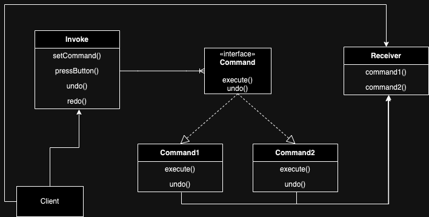

# Command design pattern

It is a Behavioral design pattern.

**Problem:**

- this code has a lack of abstraction, and the client and the command class are tightly coupled.
If in the future, the turnOnAC() method needs to be preceded (for setup) by some other methods, then the 
client will need to be aware of this and need to make appropriate changes.
- How will we undo and redo the commands? (command classes method calls)
In the above setting we will need to call the turnOffAC() method to undo the turnOnAC() method (client needs to be aware of this).
But this won't be a good solution and will make the code bulky if the steps are complex.
Hint: client shouldn't have to know how to undo and redo the commands. The command class needs to implement this functionality.

**Solution:** Use command design pattern.

It divides the logic into three parts:
- Receiver: This is like the AirConditioner class in the above example. Has all the methods to control it
- Command: All the commands that are available for the client to invoke. Makes use of the methods in receiver to execute commands
- Invoker: The client will have access to this object. Based on the command the client wants to execute, it will call the execute() method of the command object.

- The command class can now implement the steps to perform the necessary action (solves problem 1)
- Any new command can be added or updated without affecting the client code (solves problem 1)
- The invoker can use a stack to keep track of command's order and perform undo redo as needed by client (solves problem 2)
- The exact undo and redo (call execute method) logic is implemented in the command class itself (solves problem 2)

## Additional read
- https://refactoring.guru/design-patterns/command
