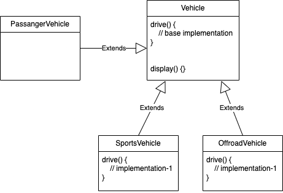
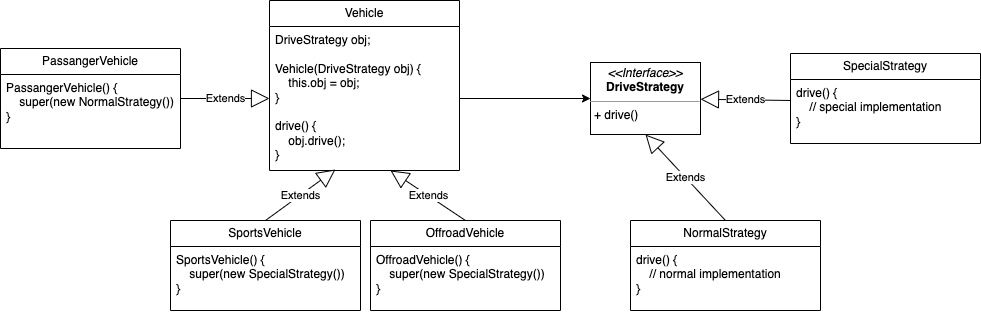

# Strategy design pattern

It is a Behavioral design pattern.

It can happen that different child classes might want to have their own implementation of the base methods.
And in this process, we identify that few child classes have the exact same overridden implementations.

### Use-case:
Child classes are having the same code logic which isn’t implemented
by the base code or is different from the base code.
In this case, all such child classes will have to implement the same logic, which is a code duplication.
That's where a Strategy pattern comes into the picture.

### Problems
code duplication keeps increasing when scaling with more child classes, 
and the overridden method implementation is common amongst multiple children,
but different from the base implementation.

Here implementation-1 is the repeated code.

### Solution

The DriveStrategy is decided by the child class and injected using super.
Depending on which DriveStrategy's child class obj is injected,
the respective drive method gets called. The implementation is
out of the child classes, and the only thing they need to do is to
inject the respective DriveStrategy's obj that they want to use.

Here we are essentially trying to separate out the dependency of
drive method from the parent class by making various **strategies** that
can be injected dynamically based on child classes requirements.

All such methods (mentioned in use-cae) are implemented in their respective Strategy classes, and 
injected into the child classes based on what the child wants/does.

## Additional read
- https://refactoring.guru/design-patterns/strategy
