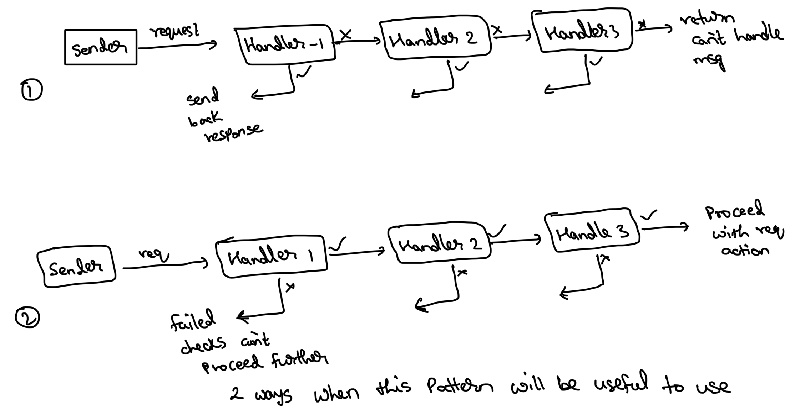
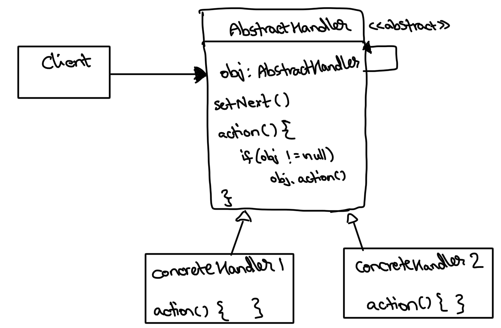

# Chain of Responsibilities

This is a Behavioural design pattern.

**Direct application Use cases:**
1. Design ATM or Vending machine - type 1
2. Design Logger - type 1
3. Authentication/Authorisation system - type 2
4. …..

Whenever a sender sends a request, and it isn’t concerned about who amongst the receiver’s would fulfill that request.
This is where chain of responsibilities pattern can be used.

It has 2 implementation variants:

**Type-1:** The request will be propagated forward till a suitable receiver for processing that request isn’t identified.
Whichever receiver fulfilling the request, will send back the response to the sender directly and propagation would be stopped.

**Type-2:** Alternatively, the chain can keep going forward if the current handler succeeds, if any handler fails the
checks then we can send back a failed message to sender. If all receiver's succeed then we can pass to whichever is the
main action that is to be performed.

### class diagram

Each concrete handler classes need to extend the Abstract handler class, this will help us decouple the code from the
concrete class and allow us to compose different chains during runtime.

Through chaining the handlers dynamically (based on use case), we can avoid code duplication.
