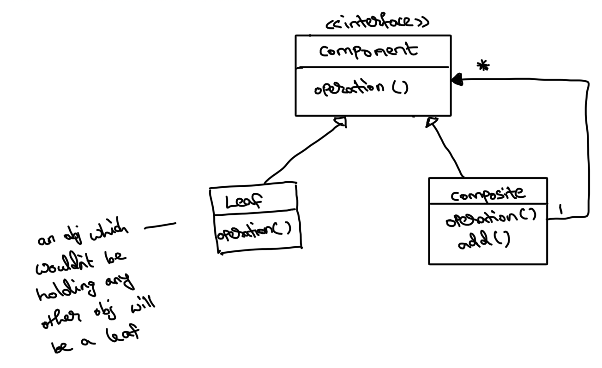

# Composite pattern

This is a structural design pattern - as it creates tree like structure of a group of objects.

Object inside object - It happens in a tree like structure, each object would hold its 2 (or more) child node’s objects (except the leaf nodes). Any problem that can be represented as a tree can be solved using composite design pattern.
Ex: employee hierarchy, File system

**Problem:** When we want to loop over the tree and calculate something, if not using composite pattern, we will need to use if else conditions to check which class the obj belongs to (the child objs can be of diff types - in file system obj can be either a file or directory) and then type cast the obj to respective class type before using it. Composite pattern solves this need for if-else and type casting.

Leaf is like a simple object (won’t hold any obj inside it)
Composite is like a complex object, which is composed of other objs (either Leaf/Composite)

Here each of the node objs (Composite) would be holding other objects of type Component. As it is the parent class, we can avoid the if-else check and type casting requirement directly. The client object can basically treat all objects (Leaf/Composite) as the same through the Component interface and call the operation method independently.
