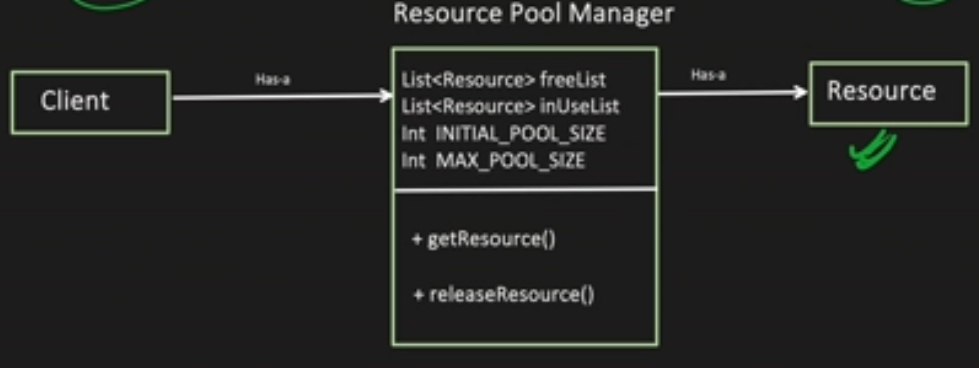

# Object Pool design pattern

This is a creational design pattern. It is used to manage the pool of reusable 
objects. It is similar to Thread pooling. The object is borrowed from the pool, used, and
then returned to the pool.

- freeList: It is a list of free objects.
- inUseList: It is a list of objects that are currently in use.

Two things to keep in mind when using this pattern:

1. We need thread safety in getResource and releaseResource methods.
2. Also, the Resource pool Manager should be implemented using a singleton pattern!
It doesn't make sense to have multiple resource pool managers unless they’re of different types.
