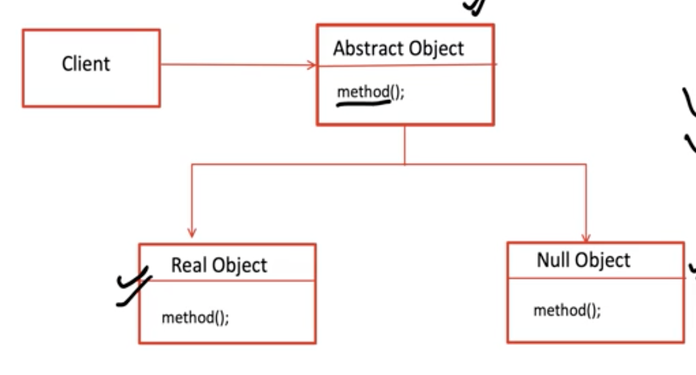

# MULL Object design pattern

It is a Behavioral design pattern. In short, this is the LLD of handling NULL objects in a better way.

Problem: If there is a method that takes in an object and invokes some methods of that object, then 
if the object is NULL, then we need to handle the NULL object case in the method. Needed as the object can hold either
an actual value or NULL. 

Handling can be simply done using `!= null` check. But this can lead to code duplication as this check needs to be added
in all the methods in our project. How can we avoid this necessity for a null check everywhere in the project? 
That is where NULL Object pattern comes into the picture.

- Instead of returning `null` we now return a NULL object
- NULL objects reflects `do nothing` or `default` behaviour

The Real objects are the actual child classes of the Abstract class, for example, if Vehicle is the abstract class, 
then Car, Bike, etc. would fall under a Real object. The Null object is going to be a default object which will be
returned whenever a null value is returned by a method returning a vehicle object

Now we can either choose to validate if the object is an actual or null object. Or we can instead choose to completely
ignore the validation check and let our code behave as if a `do nothing` or `default` object was passed. Either way, the
code will execute without any breaking issues; we just need to be aware of the possibility of default behavior, which
is still better than code crashing due to calling a method on null.

Using this pattern removed the strict necessity to have null checks.
