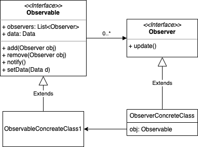

# Observer pattern

It is a Behavioural design pattern.

There will be 2 objects
1. Observable
2. Observer

As and when there is a state change in observable object,
all the corresponding observer obj’s which are observing
this obj will get an update notification.

#### Will need:
1. Observable interface
    1. List<Observer> obsList
    2. add(Observer obj)
    3. remove(Observer obj)
    4. notify()
    5. setData(DataType data)
    6. getData()
2. Observer interface
    1. update()
3. Observable Concrete class - implements all the Observable interface methods
4. Observer Concrete class - implements “update” method
    1. This would have a “has a” relation with the Observable concrete class - injected via constructor.
    2. through this Observer concrete class will know which Observable is it observing and also the data held by the Observable.
    3. Observer class will know and control which Observable class it will/can observe.

Observable interface will have a one-to-many relationship with Observer.

notify() method would get called whenever setData() is called
and defined notify criteria is met.

### Use case:
To implement “Notify Me” feature to send notification whenever
a product of user choice is back in stock.
