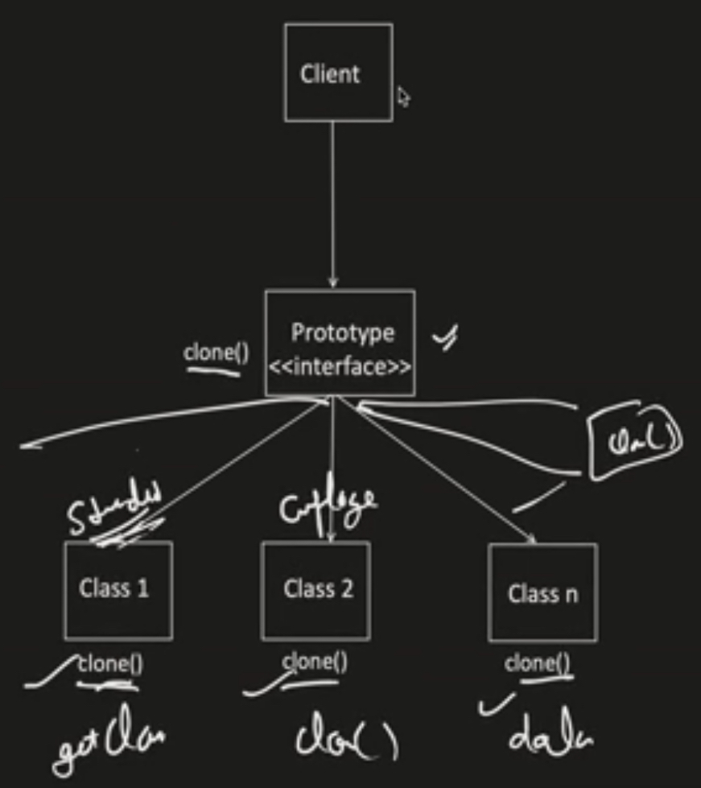

# Prototype design pattern

This is a creational design pattern. It is used when we have to make a copy/clone from existing object,
and the creation of this existing object is expensive and time-consuming.

Mainly helpful when these clone objects are needed to have some minor changes/additions on top of the existing object, 
like changing the value of some fields.
Also, if any of the fields in existing object are private, then we can't access them directly from the client, in such
cases we can use prototype pattern to clone the object and make necessary changes.

Client won't have to know what all attributes are there in the object, they can just clone the object and make necessary changes.
The cloning process is done by the prototype object itself, and the client need not know everything about the object.

As seen in the image, each class would define its own cloning logic, this alleviates the issues with private variables,
as the class would have access to its private fields and can clone them. Also, the class can decide which fields to
clone and which to ignore (control is with the class, and not with the client).

This prototype interface lets you clone an object without coupling the client's code to the class of that object.

## Additional read
- https://refactoring.guru/design-patterns/prototype
