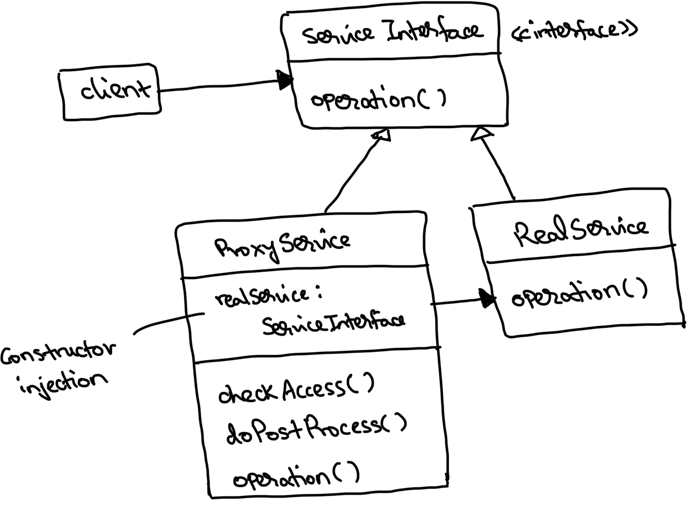
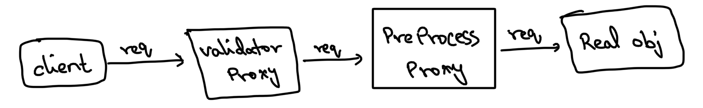

# Proxy design pattern

This is a structural design pattern.

This is a very commonly used pattern and is used almost everyday without even realising.

When a client requests an operation on a real object, we can add a proxy object in between which intercepts all these
requests (and their responses) to the real object. This is proxy design pattern.

The proxy class would have the same interface as the real class. This allows the proxy obj to be disguised as the real obj.

**Why?**
1. Caching
2. Pre/Post-processing
3. Validations
4. Access restriction
5. Lazy initialisation
6. Logging

These can be run in the proxy and post that the actual real object can be called to carry out the actual requested
operation. The proxy can hold all these centralised operations.
The actual work is still done by the real object only, only the interceptor work is done in the proxy objs.

Another common usage of proxy is to do lazy initialisation, the real obj may be a very resource (memory)
intensive obj but may be needed only from time to time. In that case instead of having the real obj to be always up on
memory right from application start, we can create it only when needed through the proxy obj and
then dismiss it after usage (if needed) to free up memory.

The real obj’s methods will be only responsible to carry out the operation. The proxy obj’s methods will have
responsibility to execute these centralised operations and take the appropriate next step.
These ops can be applied either before or after req goes through to real obj (based on use case).

We can actually chain multiple proxies (each with their own responsibilities) and build a dynamic op executor.
Effectively combining chain of responsibility pattern with proxy pattern.

