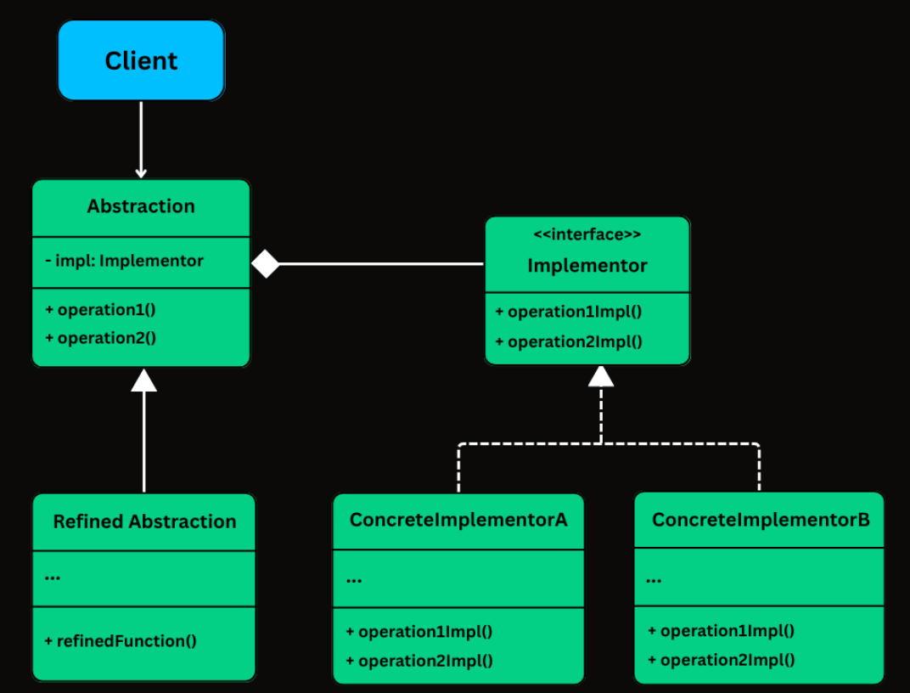

# Bridge Pattern

The Bridge Pattern is a structural design pattern that decouples an abstraction from its implementation so that the two can vary independently.

**abstraction has-a implementation** — the abstraction delegates work to an implementor object.

## Participants

*   **Abstraction**: Defines the abstraction's interface (the abstraction's core). Maintains a reference to an object of type `Implementor` and delegates work to it.
*   **RefinedAbstraction**: Extends the interface defined by `Abstraction` to add extra behavior, but still the implementor does the main work.
*   **Implementor**: Defines the interface for implementation classes. It declares the low level operations.
*   **ConcreteImplementor**: Implements the `Implementor` interface and defines its concrete implementation.

This decoupling between Abstraction and Implementor allows them to grow independently.

## When to use the Bridge Pattern?

*   When you want to avoid a permanent binding between an abstraction and its implementation. This might be the case, for example, when the implementation must be selected or switched at run-time.
*   When both the abstractions and their implementations can have their own independent hierarchies.
*   When you want to share an implementation among multiple objects, and this fact should be hidden from the client.
