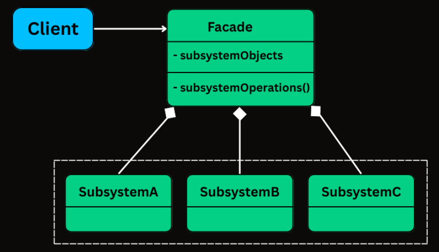

# Facade pattern

This is a structural design pattern. It is used when we want to provide a unified, simplified interface to 
a complex sub-system, making it easier for clients to interact with multiple components without getting 
overwhelmed by their intricacies.

Basically, instead of the client app directly interacting and coordinating with each sub system, we will have
an interface that does all the coordination the client should only know about the interface and its methods.

## Example

In this example, we have an e-commerce application where a customer can place an order.
The order placement process involves multiple subsystems:

1.  **InventoryService**: Checks if the product is in stock.
2.  **PaymentService**: Processes the payment.
3.  **ShippingService**: Arranges for the product to be shipped.

Without the Facade pattern, the client would have to interact with each of these subsystems directly,
which can be complex and error-prone. The client would need to know the order of operations and how to
handle failures in each subsystem.

With the Facade pattern, we introduce an `OrderFacade` that provides a simple `placeOrder` method.
The client only needs to call this method, and the facade takes care of coordinating the subsystems.

### Structure

*   `Main.java`: The client application that uses the `OrderFacade` to place an order.
*   `facade/OrderFacade.java`: The facade that simplifies the order placement process.
*   `subsystems/InventoryService.java`: A subsystem that manages inventory.
*   `subsystems/PaymentService.java`: A subsystem that handles payments.
*   `subsystems/ShippingService.java`: A subsystem that manages shipping.
